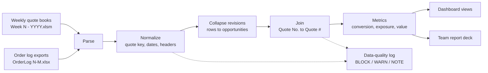

# Quote Outcome Atlas — Product & Engineering Handoff Specification

| | |
| --- | --- |
| **Product owner** | Nucor Building Systems — Estimating |
| **Primary deliverable** | `quote-conversion-atlas-shareable.html` |
| **Companion references** | `DATA-EXTRACTION-MAP.md`, `SHARE-README.md` |
| **Spec version** | 2.0 |
| **Last revised** | 17 Aug 2026 |
| **Status** | Active — single source of truth |
| **Supersedes** | v1.0 handoff spec and the earlier engineering brief |

> **This document is the contract.** It defines what the dashboard is for, what it must do, how data must be handled, and how future code and design changes are verified. Where this document and any older brief disagree, this document wins — except where [§13 Open questions](#13-open-questions--must-be-resolved-before-replatform) explicitly says a decision is still outstanding.

---

## Conventions

**Requirement keywords** follow RFC 2119:

- **MUST** / **MUST NOT** — non-negotiable. A build that violates one is not shippable.
- **SHOULD** — strong default. Deviation requires a written reason in the change notes.
- **MAY** — genuinely optional.

**Requirement IDs** are stable and referenced from the [Definition of done](#14-definition-of-done). Never renumber an existing ID; retire it and add a new one.

| Prefix | Domain |
| --- | --- |
| `P-n` | Product / behavior |
| `D-n` | Data intake, parsing, matching |
| `M-n` | Metric definitions and calculations |
| `V-n` | Visual and interaction |
| `K-n` | Team report deck |
| `T-n` | Technical architecture and code quality |

**Severity** on validation rules: **BLOCK** halts the run with a specific error. **WARN** renders results with a visible, countable flag. **NOTE** is recorded in the data-quality log only.

---

## Contents

1. [Product purpose](#1-product-purpose)
2. [Non-negotiable product requirements](#2-non-negotiable-product-requirements)
3. [Canonical vocabulary](#3-canonical-vocabulary)
4. [Metric definitions and formulas](#4-metric-definitions-and-formulas)
5. [Required user workflow](#5-required-user-workflow)
6. [Input contract and extraction rules](#6-input-contract-and-extraction-rules)
7. [Matching, ownership, and data quality](#7-matching-ownership-and-data-quality)
8. [Required calculations and analytics](#8-required-calculations-and-analytics)
9. [Visual and interaction specification](#9-visual-and-interaction-specification)
10. [Team report deck requirements](#10-team-report-deck-requirements)
11. [Technical architecture and code quality](#11-technical-architecture-and-code-quality)
12. [Verification baseline](#12-verification-baseline)
13. [Open questions — must be resolved before replatform](#13-open-questions--must-be-resolved-before-replatform)
14. [Definition of done](#14-definition-of-done)
15. [Handoff instruction](#15-handoff-instruction)
- [Appendix A — Known defects in the current build](#appendix-a--known-defects-in-the-current-build)
- [Appendix B — Change log](#appendix-b--change-log)

---

## 1. Product purpose

Quote Outcome Atlas is an offline, laptop-first management dashboard that turns weekly quote books and order logs into a clear answer to four questions:

1. **How much work was quoted?**
2. **How much quoted work returned as a confirmed order?**
3. **How much work is still unconverted and needs a current seller-owned outcome?**
4. **What operational, people, timing, customer, and booked-ton signals sit behind that outcome?**

It exists to make a management review more useful, more visual, and easier to understand than reviewing raw Excel files. It must be polished enough to show a boss, practical enough to use every week, and accurate enough that **no person is credited or blamed using the wrong source data**.

### 1.1 The pipeline in one view



### 1.2 Non-goals

Stating these prevents well-meant scope drift:

- **Not a sample mock-up.** It MUST calculate from the files the user selects. Demo data MUST NOT be shipped in the distributed file.
- **Not a CRM or forecast tool.** It reports what the source files say; it does not predict, score, or assign probability to open work.
- **Not an individual performance ranking pack.** People views exist to inform coaching conversations, not to produce a league table. Deck exports are team-level by default.
- **Not a system of record.** It never writes back to Excel and never becomes the authoritative quote history.
- **Not a loss report.** An unmatched quote is unconverted, not lost.

---

## 2. Non-negotiable product requirements

| ID | Requirement | Required behavior |
| --- | --- | --- |
| **P-1** | Portable handoff | One self-contained HTML file that can be emailed, opened by double-click in Edge/Chrome, and uploaded to Claude for technical edits. |
| **P-2** | No installation | MUST run on a locked-down corporate laptop with no server, Python, Node, database, IT ticket, or internet connection. |
| **P-3** | Any reporting span | The user can load 4 weeks, 20 weeks, or another reasonable count. The build MUST NOT assume a fixed 10-week layout anywhere in code, layout, or copy. |
| **P-4** | Direct import workflow | Select weekly quote books, select one or more order logs, press one prominent **Run dashboard** button. |
| **P-5** | Correct attribution | Order log `Quote #` matches weekly `Quote No.` after normalization. Ownership comes from the quote book, never from a post-order job role. |
| **P-6** | Clear business language | Use the canonical terms in [§3](#3-canonical-vocabulary). Unmatched work MUST NOT be called a loss. |
| **P-7** | Conversion is the hero | Quote-to-order conversion is the primary seller view. The percentage MUST be the largest single value on the overview, and the quoted → confirmed → unconverted story MUST be readable in seconds. |
| **P-8** | Visual quality | Deliberate and modern: strong type hierarchy, clean charts, meaningful motion, clear values. No collisions, crossing flow lines, or decorative fluff. |
| **P-9** | Laptop readability | Text, chart labels, names, cards, and deck slides MUST be readable at normal laptop distance. No tiny low-contrast body text. |
| **P-10** | Accurate team views | Engineers, estimators, and schedulers MUST be mapped from the selected files — by roster name where available, by initials otherwise. |
| **P-11** | Useful export | The deck button MUST produce a real, readable, team-level HTML report that prints to PDF. It MUST NOT be a copy of the dashboard front page. |
| **P-12** | Theme integrity | Light and dark themes MUST both work, preserve contrast, and have no broken states. |
| **P-13** | Brand continuity | The embedded Nucor mark MUST remain in the portable file, embedded — no external image dependency. |
| **P-14** | Honest coverage | Any metric computed over a subset of records MUST display its denominator and coverage percentage next to the value. See [M-8](#4-metric-definitions-and-formulas). |

> **P-14 is new in v2.0** and closes a real defect: on-time release is currently presented as a full-book figure when it is scored on a small minority of records. See [Appendix A, A-1](#appendix-a--known-defects-in-the-current-build).

---

## 3. Canonical vocabulary

These labels are required everywhere — UI, deck, tooltips, exports, and code identifiers. A future developer or AI MUST NOT reinterpret them.

| Use this | Never use | Meaning |
| --- | --- | --- |
| **Quote opportunity** / **quoted work** | "quote", "bid", "lead" | One distinct normalized quote record after revisions are collapsed. |
| **Quote win** / **confirmed order** | "sale", "closed-won" | A quote opportunity whose normalized key appears in an order log `Quote #`. |
| **Booked job** | "order", "win" | One matching job row in the order log. One quote win MAY create several booked jobs. |
| **Unconverted opportunity** | "loss", "lost quote", "dead" | A quote with no linked order in the selected logs. May be open, lost, awaiting decision, or missing a link. |
| **Quote conversion** | "win rate", "hit rate" | Distinct quote wins ÷ distinct quote opportunities. |
| **Won-value capture** | "revenue rate" | Value of quote opportunities with a linked order ÷ all quoted value. |
| **Exposure lens (30+ / 50+ days)** | "aged", "stale" | Restricts the cohort to quotes old enough to have had a fair decision window. |
| **On-time release** | "performance", "SLA" | Share of *scored* quote records marked `EARLY` rather than `LATE`. Independent of conversion. |
| **First seen in loaded book** | "new customer" | A customer appearing in exactly one selected quote week. Does **not** prove the customer is new to Nucor. |
| **Repeat customer** | "existing account" | A customer appearing in two or more selected quote weeks. |
| **Repeat / no linked win** | "losing account" | A repeat customer with quote activity but no matching quote win in the cohort. A follow-up queue, not a loss list. |

---

## 4. Metric definitions and formulas

Every formula below MUST be implemented once, in a shared module, and referenced everywhere. Duplicated business arithmetic is a defect.

| ID | Metric | Formula / rule |
| --- | --- | --- |
| **M-1** | Quote conversion | `distinct quote wins ÷ distinct quote opportunities` in the active cohort. **MUST NOT** divide booked jobs by quotes. |
| **M-2** | Won-value capture | `Σ quoted value of opportunities with a linked order ÷ Σ all quoted value` in the active cohort. |
| **M-3** | Exposure days | `exposure = order_log_cutoff_date − quote_date`, both floored to calendar date, no time component, no timezone conversion. A quote with `exposure ≥ 30` qualifies for the 30+ lens; `≥ 50` for the 50+ lens. |
| **M-4** | Order-log cutoff | The **latest valid `Order Entry` date** across all selected order logs. A single implausible future date MUST NOT set the cutoff — see [D-13](#73-required-validation-behavior). |
| **M-5** | On-time release | `count(EARLY) ÷ count(scored records)`, where a scored record has a non-blank `On-time` value resolving to `EARLY` or `LATE`. Records with blank or unrecognized values are **excluded from both numerator and denominator** and reported as unscored. |
| **M-6** | Quote-to-order lag | `Order Entry date − quote date` for matched pairs. Report median, p10, p90. Negative lags are invalid and MUST be flagged, not clamped. |
| **M-7** | Wilson 95% interval | For `p̂ = x/n`, `z = 1.959964`: `centre = (p̂ + z²/2n) / (1 + z²/n)`, `half = z·√(p̂(1−p̂)/n + z²/4n²) / (1 + z²/n)`. Display as `centre ± half`. When `n = 0`, display "no records", never `0%`. |
| **M-8** | Coverage | For any metric whose denominator is smaller than the active cohort, `coverage = scored records ÷ cohort records`. The UI MUST show `value (n of N, coverage%)`. |
| **M-9** | Thin-sample marking | Any rate with `n < 10` MUST render in a visibly neutral/de-emphasized state and MUST NOT be ranked as proof of performance. |
| **M-10** | Rate targets | On-time release target: **90%**. Quote conversion reference line: **10%**. Both are display references only — they MUST be defined in one constants block and labeled in the UI, never hardcoded per chart. |

> **M-10 is new in v2.0.** The previous spec never defined these two numbers, yet both appear in the shipped deck. They are now stated once, here.

---

## 5. Required user workflow

1. Open `quote-conversion-atlas-shareable.html` in current Microsoft Edge or Google Chrome.
2. Go to **Data Mapping**.
3. Use **Add quote weeks** to select any number of `Week N - YYYY.xlsm` / `.xlsx` files.
4. Use **Add order logs** to select **every applicable** order-log export together — e.g. `OrderLog 1-10.xlsx` *and* `OrderLog 11-20.xlsx`.
5. Press **Run dashboard**.
6. Review at the default **30+ day exposure** lens, then switch to All Quotes or 50+ days as needed.
7. Use the overview, people, quotes, customer, timing, and booked-ton views to guide the team conversation.
8. Export the team report deck when a presentation-ready update is needed.

**P-15 — Trustworthy intake.** The opening import screen MUST be blank. It MUST NOT display a previous run, a cached dataset, or sample figures as if they were current source data. If an IndexedDB cache exists, restoring it MUST be an explicit, labeled user action showing the cached run's date and file list.

---

## 6. Input contract and extraction rules

> **Column letters below are hints, not the contract.** Per [T-4](#113-code-rules), critical fields MUST be resolved by scanning header labels. Letters are a documented fallback and a sanity check only. A shifted column MUST NOT silently reassign a person or a price.

### 6.1 Weekly quote workbooks

Accepted files follow a tolerant form of `Week N - YYYY.xlsm` / `.xlsx`. Upload prefixes are allowed as long as a week number can be recognized.

**Read only these sheets:** Monday, Tuesday, Wednesday, Thursday, Friday.

**Do not read:** `End of Week Totals` (aggregates, not records) and `Scheduler` (not a roster). Read `Inventory` separately for employee names.

Data starts at **row 6**. A weekday row is a quote record **only when `Quote No.` is populated**. The second row of a two-row entry block MUST NOT become a second opportunity.

| Weekly field | Hint | Required use |
| --- | --- | --- |
| Quote No. | B | Primary quote identity and order-log join key. |
| Version | C | Revision reconciliation. |
| Project | D | Quote-side project context. |
| Customer | E | Customer signals and quote explorer. |
| Square feet | H | Size / volume context. |
| Date In | I | Turnaround diagnostics, only after validation. |
| Due | J | Timing diagnostics where supplied. |
| Done | P | Timing diagnostics where supplied. |
| Scheduler | L | Quote responsibility and team performance. |
| Quote Engineer | M | Quote responsibility and team performance. |
| Estimator | N | Quote responsibility and team performance. |
| Actual Hours | O | Productivity measures. |
| On-time | Q | `EARLY` / `LATE` release-rate metric. |
| Price | S | Quoted value and value capture. |

### 6.2 Inventory roster

Read the `Inventory` sheet of the selected workbooks to resolve initials to a supplied name.

| Inventory field | Hint | Required use |
| --- | --- | --- |
| Name | A | Full label in People and quote-detail views. |
| Initials | B | Match to weekly Scheduler / Engineer / Estimator codes. |

**Rules**

- **D-1** — Quote Engineer and Estimator lists MUST include every relevant person found in the selected roster, even with zero quotes in the active cohort.
- **D-2** — Scheduler rows are seeded from the weekday Scheduler field unless a dedicated scheduler roster is supplied.
- **D-3** — An initials code with no roster name MUST display the initials plus the label `roster name not supplied`.
- **D-4** — A quote with no initials MUST display `No initials supplied`. The build MUST NOT fabricate a person or show a generic `Unassigned` team member.

### 6.3 Order-log exports

Read `Sheet1`; data starts at **row 3**. A row is a booked job **only when Job Prefix is present**.

| Order-log field | Hint | Required use |
| --- | --- | --- |
| Job Prefix / Job Number / Job Name | A / B / C | Booked-job identity and readable linked-job context. |
| Customer / CSR | D / E | Job-side audit context. |
| Order Entry | H | Reporting cutoff and quote-to-order lag. |
| Total Tons | M | Booked tons by order-entry week. |
| Total Engineering Hours | N | Post-order operating context. |
| Post-order assignments | Q / R / S | Job context only. |
| Quote # | Z | **The only allowed quote-attribution join field.** |
| Sales Engineer | AA | Job context only — never quote credit. |

---

## 7. Matching, ownership, and data quality

### 7.1 Quote key normalization

**D-5** — Normalize both quote-side `Quote No.` and order-side `Quote #` with a single shared function before matching:

```text
1. Coerce to string; trim; collapse internal whitespace; upper-case.
2. Reject empty results and results with no digits  -> unparsable.
3. Split on "-".
4. If the LAST segment matches /^R\d+$/  -> drop it (revision suffix).
   Repeat once; do not strip more than one revision suffix.
5. Rejoin the remaining segments unchanged.
6. The result is the normalized key. Its segment count is NOT constrained to two.
```

`W1V-25035-R2` and `W1V-25035` both resolve to `W1V-25035`. ✅

> **This replaces the v1.0 rule "keep PREFIX-SERIAL".** That wording was ambiguous for keys with three or more segments and is the likely reason `P-0287-025-2` was dropped from attribution. Under the rule above, `P-0287-025-2` normalizes to itself and becomes matchable. Whether it *should* match is [OQ-3](#13-open-questions--must-be-resolved-before-replatform) — do not change the shipped baseline until that is decided and fixtured.

### 7.2 Revision collapse

**D-6** — All rows sharing the same normalized key are **one quote opportunity**.

| Derived property | Rule |
| --- | --- |
| Quote date and quote week | First quote row. |
| Quote Engineer / Estimator / Scheduler | First quote row — opening ownership receives quote credit. |
| Actual hours | Sum across revisions. |
| Price / square feet | Last non-blank supplied value. |
| Revision count | Number of quote rows in the group. |
| On-time result | Last non-blank supplied result. |

*"First" and "last" are by source order: weekly file week number, then weekday sheet order, then row index. This ordering MUST be explicit in code, not incidental to object-key iteration.*

### 7.3 Quote-to-order join

- **D-7** — Merge all selected order-log files **before** matching.
- **D-8** — Remove exact repeated order rows using `job identity + quoted reference + Order Entry date`.
- **D-9** — A distinct matched quote is one **quote win**. Every matching order row is one **booked job**.
- **D-10** — Retain job name, customer, and post-order roles for audit context in the quote inspector.
- **D-11** — Job Name, Sales Engineer, and the Q/R/S roles MUST NOT be used as a join key or as a substitute for quote ownership.

### 7.4 Ownership rules

**D-12** — Quote credit always originates in the weekly quote book: **Scheduler** (L), **Quote Engineer** (M), **Estimator** (N). Post-order job roles MAY supplement linked-job detail but MUST NOT overwrite, guess, or reassign quote ownership or conversion credit.

### 7.5 Required validation behavior

**D-13** — The build MUST surface each condition below rather than silently producing a wrong metric. **No exception may be counted as a lost quote or attributed to an employee by guesswork.**

| # | Condition | Severity | Required response |
| --- | --- | --- | --- |
| 1 | Critical header missing or shifted | **BLOCK** | Halt with the file name, sheet, and the header that could not be resolved. |
| 2 | Wrong Monday year in a weekly file | **WARN** | Recover the year from the `Week N` filename sequence and record the correction in the quality log. |
| 3 | Blank quote engineer | **NOTE** | Keep as a meaningful no-initials record ([D-4](#62-inventory-roster)). |
| 4 | `Date In` outside the accepted quote-week range | **WARN** | Exclude from turnaround diagnostics; keep the quote. |
| 5 | Missing or non-standard order-log `Quote #` | **WARN** | Count as unparsable, list the raw values, exclude from attribution. |
| 6 | Order quote outside the loaded quote window | **NOTE** | Report the count; this is expected, not an error. |
| 7 | Exact duplicate order rows across combined exports | **WARN** | De-duplicate per [D-8](#73-quote-to-order-join) and report how many were removed. |
| 8 | Roster code not found in `Inventory` | **WARN** | Show initials with `roster name not supplied`. |
| 9 | Repeated reporting week | **WARN** | Use the last selected file for that week and flag the duplicate selection. |
| 10 | `Order Entry` date implausibly in the future | **WARN** | Exclude from the cutoff calculation ([M-4](#4-metric-definitions-and-formulas)) and flag it. |
| 11 | Negative quote-to-order lag | **WARN** | Flag the pair; do not clamp to zero. |
| 12 | On-time coverage below 50% of the cohort | **WARN** | Render the metric with its coverage badge per [P-14](#2-non-negotiable-product-requirements). |

Rows 10–12 are new in v2.0.

---

## 8. Required calculations and analytics

### 8.1 Core outcome metrics

Distinct quote opportunities · quoted value · quote wins · booked jobs · confirmed value · unconverted count and value · quote conversion ([M-1](#4-metric-definitions-and-formulas)) · won-value capture ([M-2](#4-metric-definitions-and-formulas)) · Wilson 95% interval on every displayed conversion rate ([M-7](#4-metric-definitions-and-formulas)) · quote-to-order lag median / p10 / p90 ([M-6](#4-metric-definitions-and-formulas)).

### 8.2 Exposure

- **M-11** — Default the dashboard to **30+ days**.
- **M-12** — Support **All Quotes**, **30+ days**, and **50+ days**.
- **M-13** — Explain the active filter in plain language beside the control.
- **M-14** — Every people and team conversion comparison MUST use the active exposure cohort. Mixing cohorts within one comparison is a defect.

### 8.3 Operational and timing

On-time release ([M-5](#4-metric-definitions-and-formulas)) · quote volume by quoted week · confirmed conversion by quoted week · booked tons by order-entry week from matched jobs with valid `Total Tons` · quote hours, hours per quote, dollars quoted per hour, revisions per quote, and turnaround **where source values are available** — each carrying its coverage badge per [P-14](#2-non-negotiable-product-requirements).

### 8.4 Customer insights

Use the **quote-side** Customer field, not only the job-side field. The customer section MUST show:

- Total customer accounts in the active cohort.
- Repeat customers, and customers seen in 3+ quote weeks.
- Customers with the highest count of confirmed quote wins.
- Quoted value and returned/won value per customer row.
- Repeat customers with no linked win, framed as a follow-up queue.
- First-seen-in-loaded-book context, explicitly limited to the files selected for this run.

**M-15** — Account totals MUST reconcile: `repeat customers + first-seen customers = total customer accounts`. This identity is a required property test.

### 8.5 Team insights

The People view MUST support Quote Engineers, Estimators, and Schedulers, showing name or initials, quote volume, conversion, on-time signal, relative scale, and won value. It MUST stay readable with long names at laptop resolution. Small samples MUST be marked per [M-9](#4-metric-definitions-and-formulas).

---

## 9. Visual and interaction specification

### 9.1 Primary outcome overview

The strongest design on the page.

- **V-1** — The conversion percentage sits in a large central visual anchor.
- **V-2** — The left-to-right story is obvious: quoted work → confirmed quote wins → unconverted follow-up work.
- **V-3** — No thick crossing flow lines, no generic Sankey, no outcome boxes that compete with the conversion percentage.
- **V-4** — Use a real record-level field, not a decorative dot cloud.
- **V-5** — Group record markers into quoted-week cards showing the week, quote wins, conversion percentage, actual quote markers, and an explicit no-win treatment for weeks that returned none.
- **V-6** — Green for confirmed order links, copper/red for unconverted follow-up. Contrast maintained in both themes.
- **V-7** — Motion reinforces the story on render. It MUST NOT be a manual replay gimmick or delay comprehension.

### 9.2 Weekly pulse

- **V-8** — Bars: quote opportunities issued by quote week. Line/points: confirmed conversion rate for the same week. The two scales stay on separate lanes.
- **V-9** — Timing is a distinct signal, never visually blended into conversion.
- **V-10** — Labels, axes, values, and the reference line stay readable whether 4 or 20 weeks are loaded.

### 9.3 Encoding integrity

**V-11 (new in v2.0)** — **A bar's length and the value printed beside it MUST encode the same quantity.** If a row reads "7 wks", the bar MUST be proportional to 7 weeks. Mixing one measure in the bar and another in the label is a correctness defect, not a style choice. See [Appendix A, A-2](#appendix-a--known-defects-in-the-current-build).

**V-12 (new in v2.0)** — Semantic color is reserved. Green means *confirmed order*. Copper/red means *unconverted*. Neutral metrics — customer counts, tonnage, headcount — MUST use the neutral accent, never the win color. See [Appendix A, A-3](#appendix-a--known-defects-in-the-current-build).

### 9.4 Customer, team, and detail views

- **V-13** — Clear cards, readable table rows, visible labels, no overlapping values.
- **V-14** — Customer names MAY truncate visually but MUST carry the full label in a `title` attribute or equivalent accessible tooltip.
- **V-15** — The quote inspector shows quote number, customer, owner, quote value, exposure, release status, linked jobs, and next-action language.
- **V-16** — No employee appears as a nameless blank row or a generic `Unassigned` entry.

### 9.5 Type, color, and spacing

- **V-17** — Strong standard/system fonts for body copy and deck slides. Display or condensed type only where it improves hierarchy — never for running text, data labels, or values.
- **V-18** — Bold labels and high-contrast numeric values over faint monospaced text in management-facing content. Monospace is permitted for aligned numeric columns, at full contrast.
- **V-19** — Preserve a modern technical edge without trading away quick comprehension.
- **V-20** — Responsive grid rules so layout reflows rather than overlaps at laptop and smaller widths.
- **V-21** — Respect `prefers-reduced-motion`.

### 9.6 Themes and accessibility

- **V-22** — Both dark and light themes are required and MUST be re-checked after every design change.
- **V-23** — AA contrast where practical, visible focus states, keyboard operation, descriptive chart text, and meaningful button labels.
- **V-24** — Color MUST NOT be the only outcome cue. Because green/copper is a red-green-deficiency risk, every outcome marker MUST also carry a label, a value, or a distinct shape.

---

## 10. Team report deck requirements

The export creates a separate, self-contained HTML slide report presented with arrow keys or printed to PDF. It is a **team-level** report — not a screenshot of the main page, and not an employee ranking pack by default.

**Required slides**

| # | Slide | Content |
| --- | --- | --- |
| 1 | Executive outcome | Conversion, quoted value, confirmed value. |
| 2 | Quote outcome | Confirmed vs unconverted opportunities and value. |
| 3 | Weekly performance pulse | Quote volume and conversion on separate lanes. |
| 4 | Quote release timing | On-time definition, result, **and coverage**. |
| 5 | Commercial continuity | Booked tons, customer continuity, top quote-win customer, repeat/no-linked-win signal. |
| 6 | Management focus | Concise actions for outcome follow-up, delivery signal, next refresh. |

**Deck requirements**

- **K-1** — Six slides. The counter MUST read `1 / 6` and update correctly. The counter's initial markup MUST be generated from the slide count, never hardcoded. See [Appendix A, A-4](#appendix-a--known-defects-in-the-current-build).
- **K-2** — Slide 5 MUST include the top quote-win customer and the repeat/no-linked-win signal. Both are currently missing. See [Appendix A, A-5](#appendix-a--known-defects-in-the-current-build).
- **K-3** — Standard, bold, readable fonts; large headings and clear body text. Condensed display faces are permitted for headlines only, per [V-17](#95-type-color-and-spacing).
- **K-4** — Enough spacing around charts and cards that printing and laptop presentation stay legible.
- **K-5** — No small faint labels, no condensed unreadable text, no text overlapping decorative treatment.
- **K-6** — Identical definitions to the dashboard. No slide may imply an unmatched quote is lost.
- **K-7** — Every figure on a slide MUST carry the same coverage and thin-sample treatment as the dashboard ([P-14](#2-non-negotiable-product-requirements), [M-9](#4-metric-definitions-and-formulas)). A slide MUST NOT label a partial-coverage metric as covering the full quote book.
- **K-8** — The deck MUST render correctly with any week count the dashboard accepts ([P-3](#2-non-negotiable-product-requirements)).
- **K-9** — Print styles MUST force every slide visible and page-break between slides.

---

## 11. Technical architecture and code quality

### 11.1 Distribution architecture

- **T-1** — Final distribution remains one self-contained `.html` file with the Nucor mark, CSS, JavaScript, workbook parser, and deck generator embedded.
- **T-2** — No runtime CDN, web-font URL, API call, server, authentication, or external asset. The file MUST keep working offline after being copied to another laptop.
- **T-3** — Browser storage MAY cache a parsed dataset in IndexedDB. All storage access MUST be wrapped in `try/catch` and MUST degrade safely when blocked by policy.

### 11.2 Preferred development architecture

The distribution file may be large, but engineering MUST NOT be performed as one unstructured block. Develop in modules, test there, then bundle and inline for distribution.

```text
src/
  parse/       workbook detection, weekday extraction, order-log extraction
  normalize/   quote key, date repair, header validation, source defects
  model/       revision collapse, joins, metrics, customer/team aggregation
  ui/          overview, people, quotes, data mapping, report deck
  styles/      tokens, themes, responsive layout
test/          fixtures, unit tests, regression tests
build/         single-file bundling / inlining
```

### 11.3 Code rules

- **T-4** — Resolve critical attribution fields by scanning header labels. Column positions are a fallback and a cross-check only.
- **T-5** — Stop the run with a specific, actionable error when a critical header cannot be resolved safely.
- **T-6** — Keep parsing and model functions pure and free of DOM references so they are independently testable.
- **T-7** — Centralize quote-key normalization, exposure calculation, roster resolution, ownership, and every formula in [§4](#4-metric-definitions-and-formulas). Business rules MUST NOT be duplicated across components.
- **T-8** — Semantic function names, small focused functions, descriptive variables. Comment business rules and known defects, not obvious syntax.
- **T-9** — Escape all source text before inserting it into generated HTML — dashboard and deck alike. Customer, project, and job names are untrusted input.
- **T-10** — No `eval`, no fabricated placeholder owners, no silent coercion that changes data meaning, no destructive write-back to Excel.
- **T-11** — Retain visible error and quality counters rather than swallowing bad rows.
- **T-12** — Keep rendering efficient. 4–20 weekly files MUST feel immediate, and a larger future dataset MUST NOT freeze the interface.

### 11.4 Sharing and editability

- **T-13** — A recipient receives the HTML plus this specification and `DATA-EXTRACTION-MAP.md` — no hidden context required.
- **T-14** — Technical changes MUST preserve the offline, single-file workflow.
- **T-15** — The embedded brand asset MUST NOT be removed or replaced with an external URL.
- **T-16** — Any change affecting parsing, joins, ownership, exposure, or calculated metrics REQUIRES regression testing against the supplied workbook fixtures and the [§12 baseline](#12-verification-baseline).

### 11.5 Build-stage expansion backlog

These come from the engineering brief. They are an explicit future-build backlog — **not** a claim that every item is complete in the current portable HTML. A rework or replatform MUST account for them rather than dropping them.

| Area | Required future behavior |
| --- | --- |
| File intake | Drag/drop and click-to-browse; auto-detect quote vs order files from sheet/header evidence; report filename, detected type/week, rows found, and specific errors per file. |
| Performance | Parse larger source sets off the UI thread where possible; show progress; never block the page. |
| Incremental loading | Adding Week 11 after Weeks 1–10 merges intelligently rather than forcing a full replacement; duplicate base keys need an explicit newest-source rule. |
| Filter system | Week range, exposure, role, person, size band, customer search, and free text compose into one dismissible active-filter bar. |
| Cross-filtering | Clicking a bar, line point, person, customer, or outcome segment applies a reversible filter — not decoration. |
| Segmentation | Quote engineer, estimator, scheduler, quote-number prefix/district, customer, quote week, and size bands, all derived from loaded data rather than hardcoded. |
| Exports | CSV of the active filtered view; overview image; clean print/PDF path; uncluttered presentation mode. |
| Shareable state | A filtered view MAY be stored in the URL hash where this stays compatible with offline file use. |
| Sensitive performance data | A consistent anonymize mode replacing people with neutral identifiers across every applicable view. |
| Accessibility | Keyboard reachability, focus visibility, accessible chart data/table alternatives, reduced motion, and contrast remain release requirements. |
| Testability | Fixture tests, unit tests for business rules, a shifted-header failure test, and property checks that group totals reconcile to ungrouped totals. |

**Operating targets for a future production build**

| Target | Value |
| --- | --- |
| Parse time, 10 weeks + order logs, mid-range laptop | ~3 seconds |
| Filter re-render | ~100 ms |
| Practical model size | ≥ 10,000 quote records |
| Table virtualization threshold | ~500 visible rows |
| Bundle size | Compact enough for email/share, with no loss of offline reliability |

---

## 12. Verification baseline

The current Week 1–10 source run produces this working baseline. These are the **immediate regression checks** after any parser or model change.

### 12.1 Locked figures

| Check | Expected result |
| --- | --- |
| Raw weekday quote lines | 727 |
| Distinct quote opportunities | 614 |
| Selected order-log rows | 160 |
| Matched quote wins | 40 |
| Matched booked jobs | 41 |
| Full-book conversion | 6.51% |
| 30+ day exposure | 36 wins / 345 opportunities = 10.43% |
| 50+ day exposure | 22 wins / 157 opportunities = 14.01% |
| Total quoted value | $458,324,589 |
| Confirmed value | $25.0M (5.46% won-value capture) |
| Quote hours | 907.8 |
| Booked tons | 4,383.8 across 10 order-entry weeks |
| Parsable order-log `Quote #` rows | 87 |
| Distinct parsable order quote references | 86 |
| Order-log cutoff | 13 March 2026 |

### 12.2 Derived checks (new in v2.0)

These follow arithmetically from the locked figures and are cheap, high-signal assertions:

| Derived check | Expected |
| --- | --- |
| Revision rows collapsed | 727 − 614 = **113** |
| Order rows with no usable `Quote #` | 160 − 87 = **73** |
| Parsable order references with no matching quote | 86 − 40 = **46** (expected: outside the loaded quote window) |
| Booked jobs per quote win | 41 ÷ 40 → exactly one win produced two jobs |
| Weekly quote volume, W1–W10 | 51, 67, 56, 83, 53, 57, 55, 53, 69, 70 — **sums to 614** |
| Conversion identity | 40 ÷ 614 = 6.5147% → displays as 6.51% |

### 12.3 Figures that do not currently reconcile

**These MUST be resolved before they are treated as a baseline.** Do not pick one silently.

| Figure | Spec v1.0 said | Shipped deck says | Note |
| --- | --- | --- | --- |
| Quote-side customer accounts | 290 | **291** | 88 repeat + 203 first-seen = 291, so 291 is the internally consistent value. Confirm against a re-run. |
| Customers in 3+ quote weeks | 46 | **47** | Same one-record discrepancy; likely the same root cause. |
| On-time release | "35%" | "35% — full quote book" | The weekly on-time rates imply roughly 110–155 scored records, i.e. **~18–25% coverage**, not the full 614. See [Appendix A, A-1](#appendix-a--known-defects-in-the-current-build). |

### 12.4 Reconciliation note

An earlier engineering brief lists a different quoted-dollar total and a different count of parsable order-log quote references. The figures in [§12.1](#121-locked-figures) are the **current implemented baseline**. One non-standard order quote value (`P-0287-025-2`) is visibly excluded from attribution.

Before any replatform or parser rewrite, lock the intended quoted-dollar rule in a test fixture. **Do not silently substitute the older brief's dollar total for the current implemented baseline.**

---

## 13. Open questions — must be resolved before replatform

| ID | Question | Why it matters | Owner |
| --- | --- | --- | --- |
| **OQ-1** | Is the customer-account total 290 or 291 (and 46 or 47 in 3+ weeks)? | Two shipped surfaces disagree by one record. Fix the source, then fixture it. | Estimating + Eng |
| **OQ-2** | What is the true on-time scored coverage, and should the metric be reported at all below 50% coverage? | The current 35% is labeled full-book but is scored on a small minority of records. | Estimating |
| **OQ-3** | Should `P-0287-025-2` match, or is it genuinely a non-quote reference? | Determines whether the normalization rule in [D-5](#71-quote-key-normalization) changes the matched-wins baseline. | Eng |
| **OQ-4** | Are the 87 parsable rows inclusive or exclusive of the excluded non-standard value? | 87 rows → 86 distinct implies one duplicate; the exclusion's position in that count is unstated. | Eng |
| **OQ-5** | Which quoted-dollar rule is authoritative — this baseline's $458,324,589 or the older brief's total? | Blocks any parser rewrite. | Estimating + Eng |
| **OQ-6** | Quote hours of 907.8 across 614 opportunities implies ~1.48 h/quote and ~$505k quoted per hour. Is `Actual Hours` sparsely populated? | If so, every hours-derived rate needs a coverage badge and MUST NOT be presented as a full-book productivity figure. | Estimating |

**Until an item is resolved, the shipped baseline stands.** Resolving one means: fix the source rule, add a fixture, update [§12](#12-verification-baseline), and strike the row here.

---

## 14. Definition of done

Each item references the requirement it verifies.

### Data correctness

- [ ] Weekly and order-log files can be selected together in any practical count — [P-3](#2-non-negotiable-product-requirements), [P-4](#2-non-negotiable-product-requirements)
- [ ] Normalization and revision collapse match [D-5](#71-quote-key-normalization) and [D-6](#72-revision-collapse), including keys with 3+ segments
- [ ] Quote owner / engineer / estimator / scheduler come from weekly quote fields only — [D-12](#74-ownership-rules)
- [ ] One quote with multiple order rows reports one quote win and multiple booked jobs — [D-9](#73-quote-to-order-join)
- [ ] Exposure uses the latest valid order-entry date and is plainly explained — [M-3](#4-metric-definitions-and-formulas), [M-4](#4-metric-definitions-and-formulas), [M-13](#82-exposure)
- [ ] Every validation condition in [D-13](#75-required-validation-behavior) produces its stated severity and message
- [ ] Data exceptions are visible and never become assumed losses or guessed ownership — [P-6](#2-non-negotiable-product-requirements), [D-4](#62-inventory-roster)
- [ ] The [§12.1](#121-locked-figures) and [§12.2](#122-derived-checks-new-in-v20) figures still reconcile after parser/model changes — [T-16](#114-sharing-and-editability)
- [ ] `repeat + first-seen = total accounts` holds as a property test — [M-15](#84-customer-insights)

### Visual and product quality

- [ ] The outcome overview makes quoted work, confirmed orders, unconverted work, and conversion clear in seconds — [P-7](#2-non-negotiable-product-requirements), [V-1](#91-primary-outcome-overview), [V-2](#91-primary-outcome-overview)
- [ ] Quoted-week record cards use real imported records and expose no-win weeks — [V-5](#91-primary-outcome-overview)
- [ ] No text, chart, card, label, or control overlaps at normal laptop width — [P-9](#2-non-negotiable-product-requirements), [V-20](#95-type-color-and-spacing)
- [ ] Every bar's length matches the value printed beside it — [V-11](#93-encoding-integrity)
- [ ] Win color is used only for wins — [V-12](#93-encoding-integrity)
- [ ] Partial-coverage metrics display their denominator and coverage — [P-14](#2-non-negotiable-product-requirements), [M-8](#4-metric-definitions-and-formulas)
- [ ] Thin samples render neutrally and are not ranked — [M-9](#4-metric-definitions-and-formulas)
- [ ] Team performance shows real roster names or initials; no generic `Unassigned` — [D-3](#62-inventory-roster), [D-4](#62-inventory-roster), [V-16](#94-customer-team-and-detail-views)
- [ ] Truncated customer names retain a full accessible label — [V-14](#94-customer-team-and-detail-views)
- [ ] Light and dark themes both pass visual review — [P-12](#2-non-negotiable-product-requirements), [V-22](#96-themes-and-accessibility)
- [ ] Outcome state is never conveyed by color alone — [V-24](#96-themes-and-accessibility)
- [ ] Animation aids comprehension and respects reduced motion — [V-7](#91-primary-outcome-overview), [V-21](#95-type-color-and-spacing)

### Sharing and report deck

- [ ] No external scripts, fonts, stylesheets, image URLs, or server dependency — [T-1](#111-distribution-architecture), [T-2](#111-distribution-architecture)
- [ ] The Nucor mark is visible after the file is copied to another laptop — [P-13](#2-non-negotiable-product-requirements), [T-15](#114-sharing-and-editability)
- [ ] The deck exports six readable team-level slides with a correct, generated counter — [K-1](#10-team-report-deck-requirements)
- [ ] Slide 5 includes top quote-win customer and repeat/no-linked-win — [K-2](#10-team-report-deck-requirements)
- [ ] No slide labels a partial-coverage metric as full-book — [K-7](#10-team-report-deck-requirements)
- [ ] The deck renders correctly at 4 weeks and at 20 weeks — [K-8](#10-team-report-deck-requirements)
- [ ] Print / Save PDF works from the exported deck — [K-9](#10-team-report-deck-requirements)
- [ ] HTML + this spec + the extraction map hand off with no hidden context — [T-13](#114-sharing-and-editability)

### Code quality

- [ ] Changes made in organized modules or well-separated sections, then bundled cleanly — [§11.2](#112-preferred-development-architecture)
- [ ] Business rules live in one place — [T-7](#113-code-rules)
- [ ] Headers resolved by label, with a shifted-header failure test — [T-4](#113-code-rules), [T-5](#113-code-rules)
- [ ] Source text escaped before HTML insertion in both dashboard and deck — [T-9](#113-code-rules)
- [ ] Parser/model changes carry unit and fixture regression coverage — [T-16](#114-sharing-and-editability)
- [ ] Errors are specific, actionable, and safe — [T-5](#113-code-rules), [T-11](#113-code-rules)
- [ ] No undocumented fixed week count, ownership shortcut, or external runtime dependency introduced — [P-3](#2-non-negotiable-product-requirements), [T-2](#111-distribution-architecture)

---

## 15. Handoff instruction

Use this framing verbatim when handing off to Claude or an engineer:

> Preserve the single-file, offline browser workflow. Treat `Quote No.` → `Quote #` as the only attribution join. Retain quote ownership from the weekly Scheduler / Engineer / Estimator fields. Validate every change against the Week 1–10 baseline in §12 and the data-quality rules in §7. Do not resolve any item in §13 by guessing — fix the source rule, add a fixture, then update the baseline. Improve the design only where it makes the quote-to-order story clearer, keeps conversion prominent, and preserves laptop readability in both themes.

**Do not replace accurate source rules with a prettier but less trustworthy visualization.**

---

## Appendix A — Known defects in the current build

Observed in the shipped deck export dated 17 Aug 2026. Each is a concrete, reproducible gap against this specification.

| ID | Defect | Violates | Fix |
| --- | --- | --- | --- |
| **A-1** | On-time release is presented as `35% — full quote book`. The published weekly rates (75%, 45%, 20%, 12.5%, 45.5%, 54.5%, 25%, 12.5%, 38.1%, 31.6%) resolve to small denominators implying roughly 110–155 scored records — about 18–25% of the 614 opportunities. | [P-14](#2-non-negotiable-product-requirements), [M-5](#4-metric-definitions-and-formulas), [M-8](#4-metric-definitions-and-formulas), [K-7](#10-team-report-deck-requirements) | Change the label to `35% of N scored records (N of 614)` and add the coverage badge. Also see [OQ-2](#13-open-questions--must-be-resolved-before-replatform). |
| **A-2** | On the continuity slide, bar lengths do not match the week counts printed beside them: 8 wks → 100%, 4 wks → 68%, 7 wks → 65%, 2 wks → 64%, 2 wks → 56%. A 4-week account renders a longer bar than a 7-week account. | [V-11](#93-encoding-integrity) | Drive the bar from the same measure as the label, or label the bar with the measure it actually encodes. |
| **A-3** | The "First-seen accounts" and "Customer accounts" cards use the win (green) accent, which the spec reserves for confirmed orders. | [V-12](#93-encoding-integrity) | Apply the neutral accent to non-outcome metrics. |
| **A-4** | The deck nav counter is hardcoded as `1 / 5` in markup while six slides exist. Script overwrites it on load, so it is cosmetic — but it is a hardcoded slide count. | [K-1](#10-team-report-deck-requirements), [P-3](#2-non-negotiable-product-requirements) | Generate the counter from `slides.length`. |
| **A-5** | Slide 5 omits the top quote-win customer and the repeat/no-linked-win signal, both of which are required deck content. | [K-2](#10-team-report-deck-requirements) | Add both to the continuity slide. |
| **A-6** | Truncated customer labels (`POWERHOUSE MANAGEMENT `, `COMMERCIAL CONTRACTING`) carry no `title` attribute. | [V-14](#94-customer-team-and-detail-views) | Add full-text `title` on every truncated label. |
| **A-7** | Headings use a condensed face (`Arial Narrow`) and all numeric values use a monospaced face at reduced weight, against the readability rules. | [V-17](#95-type-color-and-spacing), [V-18](#95-type-color-and-spacing), [K-3](#10-team-report-deck-requirements) | Keep condensed type for headlines only; set values in a bold standard face at full contrast. |
| **A-8** | Slide 6 references a "90% reference" for release discipline while the weekly chart draws a "10% REFERENCE" line for conversion. Neither target was defined anywhere in spec v1.0. | [M-10](#4-metric-definitions-and-formulas) | Both are now defined in M-10; source them from one constants block. |
| **A-9** | The deck's nav page-count control is a `<button>` with `aria-label="Current slide"` but no action, announcing as an interactive control that does nothing. | [V-23](#96-themes-and-accessibility) | Render it as a non-interactive element with `aria-live="polite"`. |

---

## Appendix B — Change log

### v2.0 — 17 Aug 2026

**Structure**

- Added document control block, RFC 2119 conventions, stable requirement IDs, and a contents list.
- Added [§1.1](#11-the-pipeline-in-one-view) pipeline diagram and [§1.2](#12-non-goals) explicit non-goals.
- Split metric *definitions* ([§3](#3-canonical-vocabulary), [§4](#4-metric-definitions-and-formulas)) from metric *requirements* ([§8](#8-required-calculations-and-analytics)); the two were previously interleaved and partly duplicated.
- Rewrote the [Definition of done](#14-definition-of-done) so every item links to the requirement it verifies, removing the duplicate restatement of §2.
- Added [§13 Open questions](#13-open-questions--must-be-resolved-before-replatform) and [Appendix A](#appendix-a--known-defects-in-the-current-build) so unresolved items and live defects are tracked rather than buried in prose.
- Added [Appendix B](#appendix-b--change-log).

**Corrections and additions**

- **Normalization rule rewritten** ([D-5](#71-quote-key-normalization)): "keep PREFIX-SERIAL" was ambiguous for keys with three or more segments and likely caused `P-0287-025-2` to be dropped. Replaced with explicit, testable pseudocode.
- **Coverage requirement added** ([P-14](#2-non-negotiable-product-requirements), [M-8](#4-metric-definitions-and-formulas)): partial-coverage metrics must show their denominator. Closes [A-1](#appendix-a--known-defects-in-the-current-build).
- **On-time denominator defined** ([M-5](#4-metric-definitions-and-formulas)): blanks and unrecognized values are excluded from both numerator and denominator, and reported.
- **Wilson interval formula supplied** ([M-7](#4-metric-definitions-and-formulas)); previously named but never specified, and `n = 0` behavior was undefined.
- **Exposure arithmetic pinned** ([M-3](#4-metric-definitions-and-formulas)): date-only, no timezone conversion.
- **Rate targets defined** ([M-10](#4-metric-definitions-and-formulas)): the 90% on-time and 10% conversion references appear in the shipped deck but were never specified.
- **Encoding integrity and semantic-color rules added** ([V-11](#93-encoding-integrity), [V-12](#93-encoding-integrity)); closes [A-2](#appendix-a--known-defects-in-the-current-build) and [A-3](#appendix-a--known-defects-in-the-current-build).
- **Collapse ordering made explicit** ([D-6](#72-revision-collapse)): "first" and "last" now have a defined sort order.
- **Three validation conditions added** ([D-13](#75-required-validation-behavior) rows 10–12) and severities assigned to all.
- **HTML escaping requirement added** ([T-9](#113-code-rules)) — customer, project, and job names are untrusted input rendered into generated HTML.
- **Account-reconciliation property test added** ([M-15](#84-customer-insights)).
- **Derived regression checks added** ([§12.2](#122-derived-checks-new-in-v20)) and non-reconciling figures separated out ([§12.3](#123-figures-that-do-not-currently-reconcile)) rather than presented as settled baseline.
- **Column letters demoted to hints** ([§6](#6-input-contract-and-extraction-rules)), matching [T-4](#113-code-rules), which the v1.0 tables contradicted by labeling them "Typical source" in a required-use table.
- Split the combined `Due / Done | J / P` and `Scheduler / Engineer / Estimator | L / M / N` rows into one row per field so each maps to exactly one column.
- Corrected the deck slide count requirement to state that the counter must be *generated*, not merely display `1 / 6`.

### v1.0

Original handoff specification.
